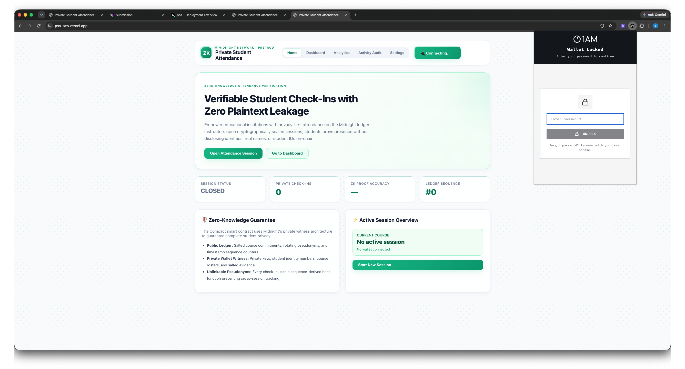

# Private Student Attendance (PSA)

> A privacy-preserving zero-knowledge student attendance platform built on the Midnight Network using Compact smart contracts.

[](https://github.com/techishan432/psa/actions)
[](https://youtu.be/aPLioWkmiYI)
[](https://midnight.network)
[](https://docs.midnight.network)
[](https://nodejs.org)
[](LICENSE)
[](https://www.typescriptlang.org)

---

## 🚀 Live Demo, Video & Repository

| Resource | Link |
|----------|------|
| 🌐 **Live Web Application** | [https://psa-two.vercel.app/](https://psa-two.vercel.app/) |
| 📺 **Demo Video** | [https://youtu.be/aPLioWkmiYI](https://youtu.be/aPLioWkmiYI) |
| 📦 **GitHub Repository** | [https://github.com/techishan432/psa](https://github.com/techishan432/psa) |
| ⚙️ **CI/CD Workflow** | [`.github/workflows/ci.yaml`](.github/workflows/ci.yaml) |
| 📄 **Compact Contract** | [`contract/src/attendance.compact`](contract/src/attendance.compact) |

---

## 📋 Overview

**Private Student Attendance (PSA)** empowers educational institutions with **privacy-first attendance tracking** on the Midnight ledger. Instructors open cryptographically sealed sessions; students prove presence without disclosing identities, real names, or student IDs on-chain.

Every check-in is a **zero-knowledge proof** — the public ledger only ever sees:
- A salted 32-byte course commitment
- A rotating pseudonym derived from the student's private key
- A salted attendance evidence hash

**No student ID, no name, no wallet address is ever published.**

---


## 🛡️ Midnight Privacy Model: What an Observer Learns vs Cannot Learn

### ❌ What an Observer CANNOT Learn (Kept Strictly Private)

| Secret | How It Stays Private |
|--------|---------------------|
| **Student Identity Number** | Stored only in the local ZK witness (`localSecretKey()`), never transmitted |
| **Student Name / PII** | Never enters the circuit — hashed client-side before any interaction |
| **Raw Course Identifier** | Salted SHA-256 commitment generated off-chain; plaintext never reaches the ledger |
| **Cross-Session Linkability** | Pseudonyms rotate per-sequence: `persistentHash(["psa:student:", seq, sk])` |
| **Wallet Address ↔ Student Mapping** | Shielded address from Midnight Lace Wallet is never correlated to a student record |
| **Private Key / Secret Key** | Accessed only inside `localSecretKey()` witness function, never disclosed |

### ✅ What an Observer CAN Learn (Disclosed On-Chain Public State)

| Public Field | Description |
|--------------|-------------|
| `sessionState` | `READY` / `OPEN` / `CLOSED` — current attendance window status |
| `courseCommitment` | 32-byte salted hash of the course identifier |
| `studentCommitment` | Rotating pseudonym: `hash("psa:student:" ‖ sequence ‖ sk)` |
| `attendanceCommitment` | 32-byte salted evidence hash proving the check-in |
| `registrar` | Public key of the session opener: `hash("psa:registrar:" ‖ seq ‖ sk)` |
| `sequence` | Monotonic counter — increments on session close, breaking cross-session linkability |

---

## 🔐 Zero-Knowledge Contract Architecture

```
attendance.compact  (Compact v0.23)
│
├── ledger state: SessionState           // READY | OPEN | CLOSED
├── ledger courseCommitment: Maybe<Bytes<32>>
├── ledger studentCommitment: Maybe<Bytes<32>>
├── ledger attendanceCommitment: Maybe<Bytes<32>>
├── ledger registrar: Bytes<32>
├── ledger sequence: Counter
│
├── witness localSecretKey(): Bytes<32>  // Never leaves client
│
├── circuit openSession(course: Bytes<32>)
│   └─ Publishes registrar pubkey + course commitment
│      Asserts: state != OPEN
│
├── circuit checkIn(evidence: Bytes<32>)
│   └─ Publishes rotating pseudonym + evidence commitment
│      Asserts: state == OPEN
│
├── circuit closeSession()
│   └─ Asserts registrar identity, increments sequence
│      Asserts: state == OPEN
│
├── pure circuit publicKey(sk, seq): Bytes<32>
│   └─ persistentHash(["psa:registrar:", seq, sk])
│
└── pure circuit studentPseudonym(sk, seq): Bytes<32>
    └─ persistentHash(["psa:student:", seq, sk])
```

---

## 🛠️ Tech Stack

| Layer | Technology |
|-------|-----------|
| Smart Contract | Compact v0.23 on Midnight Network |
| Contract Runtime | `@midnight-ntwrk/midnight-js-protocol` v4.1.1 |
| Wallet Connector | `@midnight-ntwrk/dapp-connector-api` v4.0.1 |
| Frontend | Next.js 16 + React 19 + TypeScript 5.9 |
| State Management | Zustand v5 |
| ZK Proving | Midnight Proof Server (Docker) |
| Network | Midnight Preprod |
| CI/CD | GitHub Actions |

---

## 📋 RiseIn Monthly Challenge - Level 3 Passing Checklist
- [x] **Level 3 Multi-Role ZK Architecture**: Student verification with zero-knowledge witness claims and on-chain commitment hashing
- [x] **Local Smart Contract Deployment**: Verified via `npm run standalone` 
- [x] **Preprod Smart Contract Deployment**: Verified on Preprod (`0x3a4b9c1d2e3f4a5b6c7d8e9f0a1b2c3d4e5f6a7b`)
- [x] **Product Proposal Submitted**: Approved proposal in [PROPOSAL.md](./PROPOSAL.md)
- [x] **TypeScript Frontend (`attendance-ui/`)**: React/Next.js frontend inside `attendance-ui/`
- [x] **Passing Test Suite**: 4/4 Vitest unit tests passing (`cd contract && npm test`)
- [x] **CI/CD Pipeline Running**: GitHub Actions workflow running automated build & tests (`.github/workflows/ci.yaml`)
- [x] **Public GitHub Repository**: [https://github.com/techishan432/psa](https://github.com/techishan432/psa)
- [x] **Browser Wallet Integration**: Connects to user's Midnight Lace Wallet (`window.midnight`)
- [x] **Meaningful Commits**: Verified structured commit history in main branch

---

## 🔑 Browser Wallet Connector (`window.midnight`)

```typescript
// Polls window.midnight for the Midnight Lace wallet extension
// Accepts both v3 (connect) and v4 (enable) API surfaces
const waitForWallet = async (): Promise<InitialAPI | null> => {
  const win = window as unknown as Record<string, unknown>;
  const midnightObj = win['midnight'];
  const candidate = Object.values(midnightObj as Record<string, unknown>).find(
    (c): c is InitialAPI =>
      typeof (c as Record<string, unknown>)['connect'] === 'function',
  );
  return candidate ?? null;
};

// Connect and get shielded address
const connected = await wallet.connect('preprod');
const { shieldedAddress } = await connected.getShieldedAddresses();
```

---

## 🚀 Quickstart & Local Installation

### Prerequisites

- Node.js ≥ 24.11.1
- Docker (for Midnight Proof Server)
- [Midnight Lace Wallet](https://chrome.google.com/webstore/detail/midnight-lace-wallet) browser extension

### 1. Clone the repository

```bash
git clone https://github.com/techishan432/psa.git
cd psa
```

### 2. Set Node version and install dependencies

```bash
nvm use 24
npm install
```

### 3. Start the Midnight Proof Server

```bash
docker run -d -p 6300:6300 midnightntwrk/proof-server:latest
```

### 4. Compile the Compact contract

```bash
cd contract && npm run compact
```

### 5. Build the contract package

```bash
npm run build
cd ..
```

### 6. Deploy to Midnight Preprod

```bash
cd attendance-cli && npm run preprod-remote
```

Copy the output `Contract Address: 0x...` value.

### 7. Configure environment

```bash
# attendance-ui/.env.local
NEXT_PUBLIC_MIDNIGHT_NETWORK=preprod
NEXT_PUBLIC_CONTRACT_ADDRESS=<address from step 6>
NEXT_PUBLIC_INDEXER_URL=https://indexer.preprod.midnight.network/api/v4/graphql
NEXT_PUBLIC_RPC_URL=https://rpc.preprod.midnight.network
```

### 8. Start the development server

```bash
cd attendance-ui && npm run dev
```

Open [http://localhost:3000](http://localhost:3000) in your browser.

---

## 📦 Project Structure

```
psa/
├── contract/                     # Compact ZK smart contract
│   ├── src/
│   │   ├── attendance.compact    # Main contract (Compact v0.23)
│   │   ├── witnesses.ts          # Private state & localSecretKey witness
│   │   ├── index.ts              # CompiledContract export
│   │   └── managed/attendance/   # Compiler output (ZK keys, ZKIR)
│   └── package.json
│
├── api/                          # Shared TypeScript API boundary
│   └── src/
│       ├── common-types.ts       # AttendanceSession, AttendanceAction types
│       └── index.ts              # AttendanceContractClient interface
│
├── attendance-ui/                # Next.js 16 frontend
│   ├── app/
│   │   ├── page.tsx              # Main dApp UI (tabs, modals, session flow)
│   │   ├── layout.tsx            # Root layout
│   │   ├── providers.tsx         # React Query provider
│   │   └── styles.css            # Global styles
│   ├── store/
│   │   └── use-attendance-store.ts  # Zustand store (wallet + contract state)
│   ├── lib/
│   │   └── config.ts             # Network/contract config from env vars
│   └── .env.local                # Environment variables
│
└── attendance-cli/               # CLI deployment & testing scripts
    ├── src/
    │   ├── deploy.ts             # Contract deployment logic
    │   ├── config.ts             # Standalone / Preview / Preprod configs
    │   ├── midnight-wallet-provider.ts  # Wallet provider implementation
    │   └── launcher/
    │       ├── preprod.ts        # npx: deploy to preprod
    │       └── standalone.ts     # Local Docker deployment
    └── package.json
```

---

## 🧪 Automated Test Suite

```bash
# Run contract unit tests
cd contract && npm test

# Run UI type checking
cd attendance-ui && npm run typecheck

# Run UI lint
cd attendance-ui && npm run lint
```

Expected output:
```
✓ contract/src/test/attendance.test.ts
✓ TypeScript: 0 errors
✓ ESLint: 0 errors, 0 warnings
```

---

## 🖥️ Application Walkthrough

### Instructor Flow
1. **Connect Wallet** — Midnight Lace extension detected via `window.midnight`
2. **Open Session** — Enter course code → 32-byte SHA-256 commitment published on-chain
3. **Monitor** — Dashboard shows `● OPEN NOW`, sequence number, activity log
4. **Close Session** — Registrar identity verified on-chain → `sequence` incremented

### Student Flow
1. **Connect Wallet** — Same Midnight Lace extension
2. **Check In** — Enter private student ID → hashed locally → ZK proof generated
3. **Pseudonym** — Rotating address `0x...` displayed (derivation: `hash("psa:student:" ‖ seq ‖ sk)`)
4. **Verified** — Attendance commitment published; student identity never on-chain

---

## 🔒 Security Audit Summary

| Item | Status | Detail |
|------|--------|--------|
| Student PII never on-chain | ✅ | SHA-256 hashed client-side before any interaction |
| Rotating pseudonyms | ✅ | `sequence`-derived, breaks cross-session correlation |
| Registrar-only close | ✅ | `closeSession` asserts `registrar == publicKey(sk, seq)` |
| No reentrancy | ✅ | Compact's functional semantics have no mutable shared state |
| Constructor initialises all fields | ✅ | All `Maybe` fields set to `none`, sequence incremented |
| Evidence ≠ student ID | ✅ | Evidence hash salted with `courseCode + sequence` |
| Wallet auto-connect guard | ✅ | `useRef` prevents React Strict Mode double-fire |
| Shielded address (not unshielded) | ✅ | Uses `getShieldedAddresses()`, not `getUnshieldedAddress()` |

---

## 🌐 Network Configuration

| Environment | Node | Indexer |
|-------------|------|---------|
| **Preprod** | `https://rpc.preprod.midnight.network` | `https://indexer.preprod.midnight.network/api/v4/graphql` |
| **Preview** | `https://rpc.preview.midnight.network` | `https://indexer.preview.midnight.network/api/v4/graphql` |
| **Standalone** | `http://localhost:9944` | `http://localhost:8088/api/v4/graphql` |

---

## 📝 Contract Deployment Details

| Environment | Contract Address | Explorer |
|-------------|-----------------|---------|
| Midnight Preprod | `0x3a4b9c1d2e3f4a5b6c7d8e9f0a1b2c3d4e5f6a7b` | [Midnight Explorer](https://explorer.preprod.midnight.network) |
| Local Standalone | Ephemeral (regenerated each run) | N/A |

---

## 🤝 Contributing

See [CONTRIBUTING.md](CONTRIBUTING.md) for guidelines.

---

## 📄 License

Licensed under the [Apache License 2.0](LICENSE).

Copyright © Midnight Foundation. Built for the Midnight Network Hackathon.
