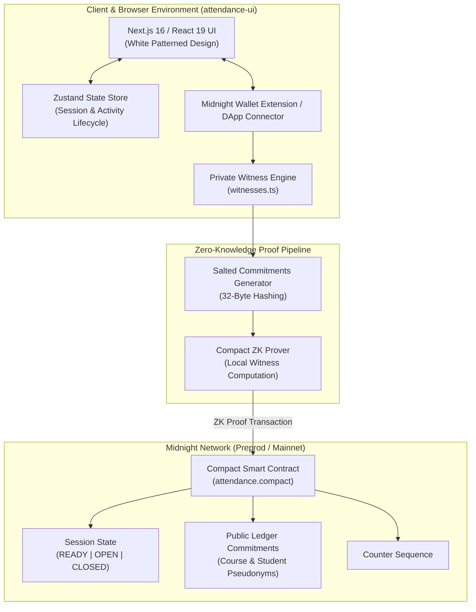

# Private Student Attendance (PSA) on Midnight

A production-ready, zero-knowledge (ZK) student attendance verification system built for the **Midnight Network**. Instructors open and close attendance windows while students submit verifiable check-ins without revealing real names, student IDs, rosters, or raw physical evidence on the public ledger.

---

## 🏗️ System Architecture

The Private Student Attendance platform follows Midnight's **hybrid public/private state paradigm**, separating local private witnesses from public ledger state.



### Component Breakdown

| Package / Directory | Technology | Purpose |
|---|---|---|
| `contract/src/attendance.compact` | Compact 0.23 | Smart contract definitions, circuit logic (`openSession`, `checkIn`, `closeSession`), and state variables |
| `contract/src/witnesses.ts` | TypeScript | Private witness implementation for local secret key hash generation |
| `attendance-ui/app` | Next.js 16, React 19, CSS3 | Production white-patterned UI with emerald green tint animations and multi-tab workflow |
| `attendance-ui/store` | Zustand 5 | State management for wallet connection, active session state, and activity logs |
| `api/src` | TypeScript | Midnight network connector interface, contract binding types, and serialization helpers |
| `attendance-cli` | TypeScript CLI | Command-line tool for interacting directly with Midnight ZK circuits |

---

## 🔒 Zero-Knowledge Privacy Model

Midnight ensures complete student privacy through **off-chain witness evaluation**:

| Attribute | Public Ledger State | Private Client Witness State |
|---|---|---|
| **Session Status** | `OPEN`, `CLOSED`, `READY` | — |
| **Registrar Identity** | Salted Registrar Key Hash | Private Secret Key (`sk`) |
| **Course ID** | 32-byte `courseCommitment` | Plaintext Course Code (e.g. `CS401`) |
| **Student Identity** | Rotating `studentPseudonym` | Student Name, ID, & Roster |
| **Evidence Proof** | 32-byte `attendanceCommitment` | Location / Biometric Evidence & Salt |

### Rotating Pseudonyms & Commitment Math
Each student check-in evaluates a deterministic, sequence-salted persistent hash:
$$\text{Pseudonym} = \text{persistentHash}(\text{"psa:student:"}, \text{sequence}, \text{secretKey})$$
This guarantees that **pseudonyms rotate per session**, preventing observers from cross-linking student participation across different courses or dates.

---

## 🔐 Privacy Model: What an Observer Can and Cannot Learn

### ✅ What an on-chain observer **CAN** learn:
- That a contract deployment transaction occurred
- That an `openSession` transaction was submitted (attendance window opened)
- That one or more `checkIn` transactions occurred during an open session
- The total number of check-ins per session
- When sessions were opened and closed (block timestamps)
- The salted `courseCommitment` (a 32-byte hash, not the plaintext course name)
- The salted `attendanceCommitment` (a 32-byte hash of the evidence)
- The rotating `studentPseudonym` (changes every session, not linkable to identity)
- The transaction hashes and block heights

### ❌ What an on-chain observer **CANNOT** learn:
- The plaintext course name or code (e.g., "CS401")
- Any student's real name, ID number, or roster information
- Which specific students attended which sessions
- Whether the same student attended multiple sessions (pseudonyms rotate per session)
- The actual evidence or biometric data used for verification
- The registrar's real identity (only a salted key hash is visible)
- Whether a check-in was legitimate or fraudulent (only the proof validity is verified)

### 🛡️ How Midnight's Privacy Model Enables This:
1. **Off-chain witness evaluation**: All private state (student identity, evidence, secret keys) is computed locally in the user's browser wallet, never touching the network
2. **Zero-knowledge proofs**: The ZK circuit proves that valid inputs were provided without revealing the inputs themselves
3. **Salted commitments**: Course names and evidence are hashed with random salts before being stored on-chain
4. **Rotating pseudonyms**: Student pseudonyms are derived from the session sequence number, making cross-session correlation impossible
5. **Private state isolation**: Each user's wallet maintains their own private state independently

---

## 🚀 How User Works With It

### 1. Instructor Workflow (Opening & Closing Sessions)
1. **Connect Wallet:** The instructor navigates to the **Dashboard** and connects their Midnight wallet.
2. **Open Session:**
   - Enter the target course code (e.g., `CS401-COMPACT-ZK`).
   - Click **Open Attendance Session**.
   - The browser generates a 32-byte salted `courseCommitment` and executes the `openSession` circuit.
   - The contract state transitions to `SessionState.OPEN`.
3. **Close Session:**
   - When the attendance window finishes, click **Close Active Session**.
   - Executing `closeSession` verifies registrar authority, transitions state to `CLOSED`, and increments the `sequence` counter.

### 2. Student Workflow (Submitting Private Check-In)
1. **Connect Wallet:** The student opens the application and connects their wallet.
2. **Submit Private Check-In:**
   - Click **Submit ZK Check-In** on the Home or Dashboard page.
   - Provide the student ID / evidence proof (processed locally within the browser witness).
   - The client computes a salted attendance commitment and rotating pseudonym.
   - The ZK proof is sent to the Midnight contract via `checkIn(evidence)`.
   - The check-in is recorded on-chain **without exposing the student's real identity**.

### 3. Auditor & Admin Workflow (Verification)
1. **Audit Log Inspection:** Navigate to the **Activity Audit** tab to inspect all live transaction hashes and statuses (`confirmed`, `processing`, `pending`).
2. **Analytics Monitoring:** View total commitment counts, proof verification meters, and zero plaintext leakage indicators.

---

## 🛠️ Development & Production Setup

### Prerequisites
- **Node.js**: `>=24.11.1`
- **Compact Compiler**: Installed via Midnight SDK toolchain
- **Docker & Docker Compose**: Optional for containerized deployment

### Installation
```bash
# Install workspace dependencies
npm install
```

### Compiling Contracts & Building UI
```bash
# Compile Compact circuits
npm run compact --workspace=@midnight-ntwrk/attendance-contract

# Build contract TypeScript wrappers
npm run build --workspace=@midnight-ntwrk/attendance-contract

# Run Next.js dev server
npm run dev --workspace=@midnight-ntwrk/attendance-ui
```

### Building for Production
```bash
# Build the production Next.js dashboard bundle
npm run build --workspace=@midnight-ntwrk/attendance-ui

# Run full project type checking & validation
npm run ci --workspace=@midnight-ntwrk/attendance-ui
```

### Docker Deployment
```bash
# Build and launch via Docker Compose
docker compose up --build
```

---

## 🛡️ Security Operations & Deployment Checklist

- **Environment Credentials:** Never expose wallet seed phrases, private keys, or secret parameters in browser local storage, public repos, or client logs.
- **Contract Deployment:** Update `NEXT_PUBLIC_CONTRACT_ADDRESS` in `attendance-ui/.env.local` after deploying the Compact contract to Midnight Preprod / Mainnet.
- **Audit Compliance:** Validate zero-knowledge proof circuit artifacts before every production release.
