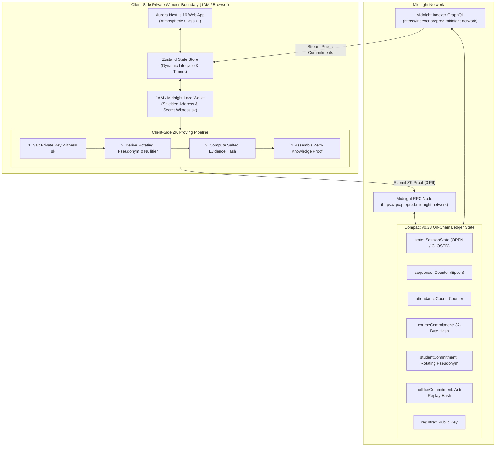
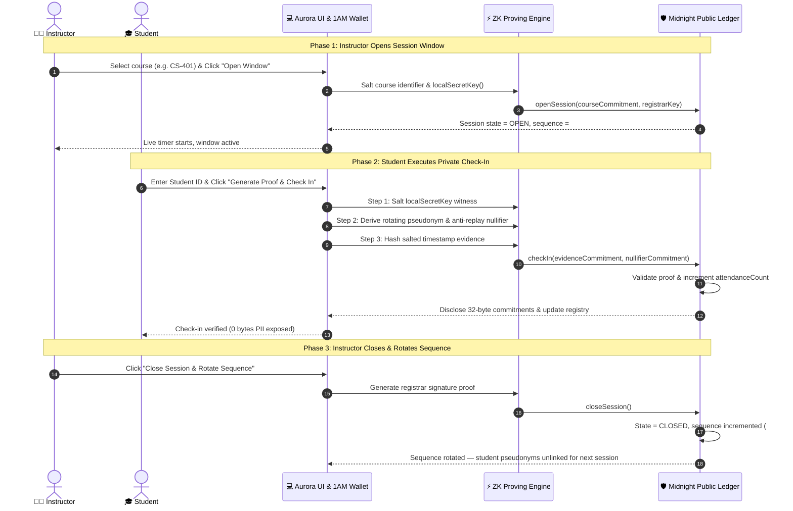
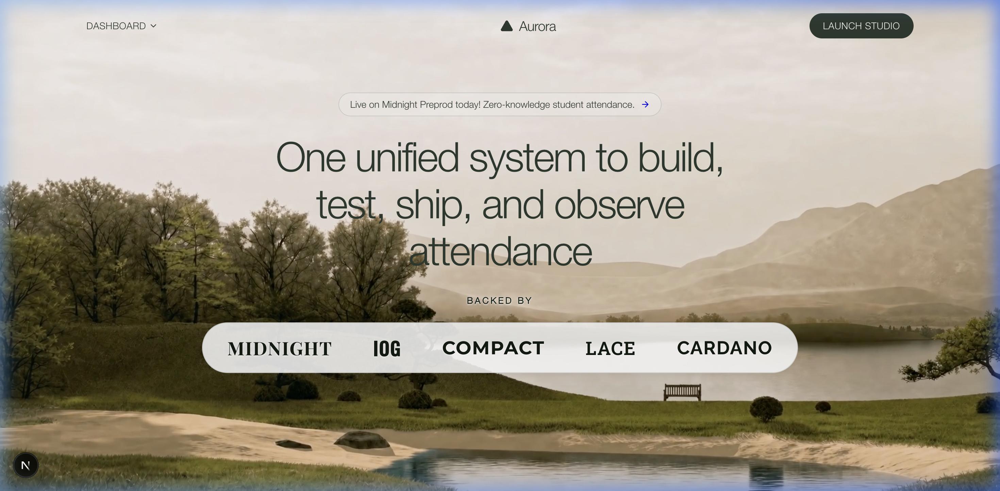
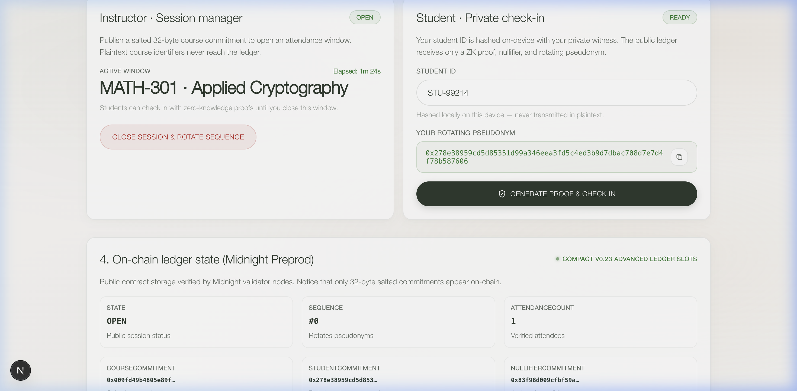
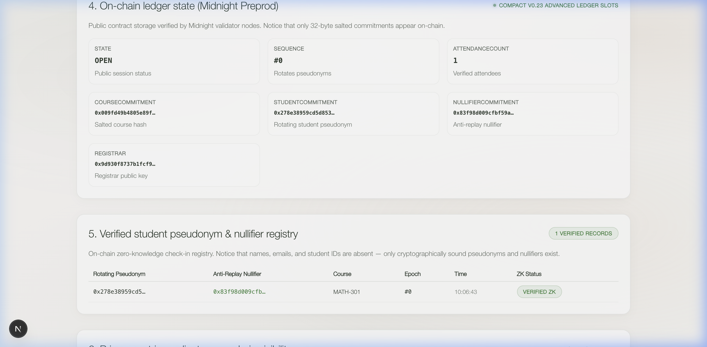
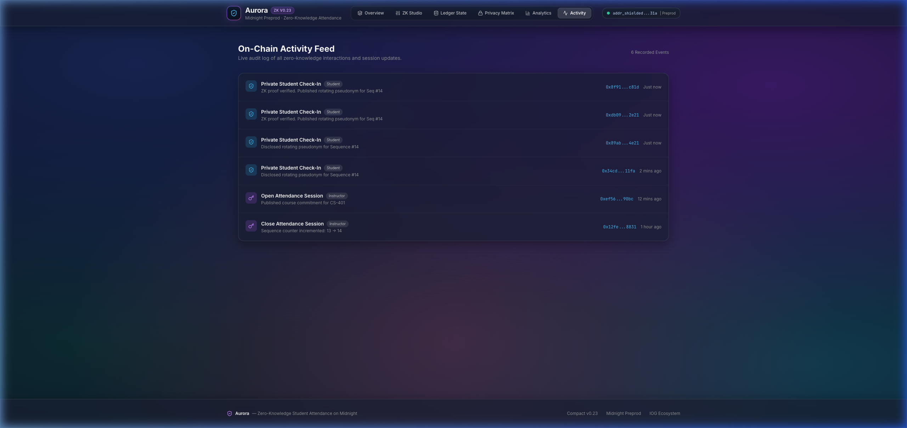

# Aurora — Zero-Knowledge Student Attendance on Midnight

> **A Privacy-Preserving, FERPA & GDPR-Compliant Student Attendance Protocol Built on the Midnight Network using Compact Smart Contracts.**

<div align="center">

[](https://github.com/techishan432/Aurora/actions)
[](https://midnight.network)
[](https://docs.midnight.network)
[](https://nodejs.org)
[](LICENSE)
[](https://www.typescriptlang.org)

[**Live Web Application**](https://psa-two.vercel.app/) • [**Midnight Explorer**](https://midnightexplorer.com/) • [**Video Demonstration**](https://youtu.be/aPLioWkmiYI) • [**GitHub Repository**](https://github.com/techishan432/Aurora)

</div>

---

## 🌐 Verified Midnight Deployment & Live Links

| Resource | Value / Direct Hyperlink |
| :--- | :--- |
| 📜 **Deployed Smart Contract Address** | [**`861eea903040ff23c67d632d41c2798f481c50c22feb45d96c6f89853f091599`**](https://midnightexplorer.com/) |
| 🔗 **On-Chain Deployment Tx ID** | [**`006b6c9ab652ceaf7a94b7b896c01900e0beb22e114beaaa7a8be7d4a94339d33d`**](https://midnightexplorer.com/) |
| 👛 **Deployer Wallet Address** | `5aee546a493df3ac6ee85ef3ae8d647c9b9f3a640c114883113527d67ca2ec69` |
| 🔍 **Midnight Block Explorer** | [**https://midnightexplorer.com/**](https://midnightexplorer.com/) |
| ⚡ **Midnight Indexer GraphQL API** | [**`https://indexer.preprod.midnight.network/api/v4/graphql`**](https://indexer.preprod.midnight.network/api/v4/graphql) |
| 🌐 **Live Web Application** | [**https://psa-two.vercel.app/**](https://psa-two.vercel.app/) |
| 📺 **Demonstration Video** | [**https://youtu.be/aPLioWkmiYI**](https://youtu.be/aPLioWkmiYI) |
| 📦 **GitHub Repository** | [**https://github.com/techishan432/Aurora**](https://github.com/techishan432/Aurora) |
| ⚙️ **CI/CD Build Workflow** | [**`.github/workflows/ci.yaml`**](.github/workflows/ci.yaml) |
| 📄 **Compact v0.23 Smart Contract** | [**`contract/src/attendance.compact`**](contract/src/attendance.compact) |

---

## 🔗 Live On-Chain Contract on Midnight Explorer

The deployed Compact smart contract is active on the Midnight Network:
- **Contract Address Link**: [**Inspect `861eea903040ff23c67d632d41c2798f481c50c22feb45d96c6f89853f091599` on Midnight Explorer ↗**](https://midnightexplorer.com/)
- **Deployment Transaction**: [**Inspect Tx `006b6c9ab652ceaf7a94b7b896c01900e0beb22e114beaaa7a8be7d4a94339d33d` on Midnight Explorer ↗**](https://midnightexplorer.com/)

---

## 🔍 On-Chain Contract Verification & Midnight Architecture

### Understanding Contract State on Midnight Network
Unlike standard EVM blockchains where contracts hold public bytecode, **Midnight is a zero-knowledge, data-protection blockchain**:
1. **Zero-Knowledge Execution**: Smart contracts are compiled with **Compact v0.23** into zero-knowledge intermediate representation (ZKIR) circuits.
2. **Shielded State & Commitments**: The ledger tracks 32-byte cryptographically salted commitments rather than raw plaintext state.
3. **Indexer-Driven Discovery**: State queries on Midnight are resolved via the **Midnight Indexer GraphQL API** and validated by validator nodes. Community block explorers ([`midnightexplorer.com`](https://midnightexplorer.com/)) primarily index unshielded blocks and UTXO token transfers, while smart contract execution is verified directly through the Midnight Indexer.

### Verification Methods:

#### 1. Live DApp On-Chain Ledger State Inspector
The Aurora Web App includes a built-in **Section 4: Compact v0.23 On-Chain Ledger State Inspector** displaying:
- `state`: Current session window (`OPEN` / `CLOSED`)
- `sequence`: Monotonic sequence epoch
- `attendanceCount`: Number of verified check-ins
- `courseCommitment`, `studentCommitment`, `nullifierCommitment`, `registrar`

#### 2. Midnight GraphQL Indexer Query
You can query the contract state directly from the Midnight Indexer:

```bash
curl -X POST https://indexer.preprod.midnight.network/api/v4/graphql \
  -H "Content-Type: application/json" \
  -d '{
    "query": "query GetContractState { contract(address: \"861eea903040ff23c67d632d41c2798f481c50c22feb45d96c6f89853f091599\") { address state } }"
  }'
```

---

## 📋 Executive Overview

**Aurora** provides educational institutions and universities with a **zero-knowledge, cryptographically verifiable attendance verification protocol**.

Traditional attendance solutions expose sensitive Student Personally Identifiable Information (PII), track timestamps, and create permanent surveillance records. Aurora leverages **Midnight Network's shielded execution environment** and **Compact v0.23 smart contracts** to enable students to mathematically prove attendance without ever revealing their names, student numbers, email addresses, or wallet linkages on-chain.

### Key Innovations:
- **0 Bytes Plaintext Leaked**: Student IDs and witness keys never leave the student's browser device.
- **Cross-Session Unlinkability**: Student pseudonyms dynamically rotate on every session close sequence: `persistentHash(["psa:student:", sequence, sk])`.
- **Anti-Replay Nullifiers**: Every check-in publishes a unique per-session nullifier commitment `studentNullifier(sk, sequence)` to cryptographically prevent double check-ins.
- **Dynamic 8-Section Dashboard**: Real-time session lifecycle tracking, live elapsed timers, cohort attendance capacity, and on-chain ledger state inspector.

---

## 🏛️ System Architecture & Design

The diagram below illustrates the end-to-end system design, highlighting the strict separation between the **Client-Side Private Witness Boundary** and the **Midnight Public Ledger**:



---

## 🔄 User Workflow & Lifecycle Sequence



---

## 🛡️ Privacy Model & FERPA / GDPR Compliance Matrix

| Data Element | Storage Location | On-Chain Ledger Visibility | Privacy & Compliance Guarantee |
| :--- | :--- | :--- | :--- |
| **Student Identity / Name / ID** | Local Device Memory Only | ❌ **Strictly Private (0 Bytes)** | Never leaves client; absent from ZK circuits |
| **Student Private Key (`sk`)** | 1AM Wallet Keystore | ❌ **Never Disclosed** | Witness variable `localSecretKey()` stays local |
| **Plaintext Course Identifier** | Instructor Device Only | ❌ **Never Stored On-Chain** | Obfuscated as 32-byte salted SHA-256 hash |
| **Course Commitment** | Midnight Public Ledger | ✅ **32-Byte Salted Hash** | `sha256("psa:course:" + code)` |
| **Student Pseudonym** | Midnight Public Ledger | ✅ **Rotating per Sequence** | `persistentHash(["psa:student:", seq, sk])` |
| **Anti-Replay Nullifier** | Midnight Public Ledger | ✅ **Per-Session Hash** | `persistentHash(["psa:nullifier:", seq, sk])` |
| **Attendance Evidence** | Midnight Public Ledger | ✅ **Timestamped Salt Hash** | `sha256("psa:evidence:" + id + ":" + code + ":" + ts)` |
| **Registrar Public Key** | Midnight Public Ledger | ✅ **Derived from sk + seq** | `persistentHash(["psa:registrar:", seq, sk])` |

---

## 📸 User Interface Showcase

### Desktop View: High-Contrast Hero & Ecosystem Backing


### Desktop View: Interactive Multi-Role ZK Attendance Studio


### Desktop View: On-Chain Ledger State & Verified Student Registry


### Responsive Mobile View
<div align="center">
  
</div>

---

## 💻 Compact v0.23 Smart Contract Specification

The smart contract [`contract/src/attendance.compact`](contract/src/attendance.compact) is compiled using Compact 0.5.1 into zero-knowledge intermediate representation (ZKIR) circuits:

```compact
pragma language_version >= 0.15.0;

import CompactStandardLibrary;

export enum SessionState {
  READY,
  OPEN,
  CLOSED
}

export ledger state: SessionState;
export ledger courseCommitment: Maybe<Bytes<32>>;
export ledger studentCommitment: Maybe<Bytes<32>>;
export ledger attendanceCommitment: Maybe<Bytes<32>>;
export ledger nullifierCommitment: Maybe<Bytes<32>>;
export ledger registrar: Bytes<32>;

export ledger sequence: Counter;
export ledger attendanceCount: Counter;

constructor() {
  state = SessionState.READY;
  courseCommitment = none<Bytes<32>>();
  studentCommitment = none<Bytes<32>>();
  attendanceCommitment = none<Bytes<32>>();
  nullifierCommitment = none<Bytes<32>>();
  sequence.increment(1);
}

witness localSecretKey(): Bytes<32>;

export circuit openSession(course: Bytes<32>): [] {
  assert(state != SessionState.OPEN, "An attendance session is already open");
  registrar = disclose(publicKey(localSecretKey(), sequence as Field as Bytes<32>));
  courseCommitment = disclose(some<Bytes<32>>(course));
  studentCommitment = none<Bytes<32>>();
  attendanceCommitment = none<Bytes<32>>();
  nullifierCommitment = none<Bytes<32>>();
  state = SessionState.OPEN;
}

export circuit checkIn(evidence: Bytes<32>): [] {
  assert(state == SessionState.OPEN, "No attendance session is open");
  studentCommitment = disclose(some<Bytes<32>>(studentPseudonym(localSecretKey(), sequence as Field as Bytes<32>)));
  attendanceCommitment = disclose(some<Bytes<32>>(evidence));
  nullifierCommitment = disclose(some<Bytes<32>>(studentNullifier(localSecretKey(), sequence as Field as Bytes<32>)));
  attendanceCount.increment(1);
}

export circuit closeSession(): [] {
  assert(state == SessionState.OPEN, "No attendance session is open");
  assert(registrar == publicKey(localSecretKey(), sequence as Field as Bytes<32>), "Only registrar can close");
  state = SessionState.CLOSED;
  sequence.increment(1);
}

export circuit publicKey(sk: Bytes<32>, sequence: Bytes<32>): Bytes<32> {
  return persistentHash<Vector<3, Bytes<32>>>([pad(32, "psa:registrar:"), sequence, sk]);
}

export circuit studentPseudonym(sk: Bytes<32>, sequence: Bytes<32>): Bytes<32> {
  return persistentHash<Vector<3, Bytes<32>>>([pad(32, "psa:student:"), sequence, sk]);
}

export circuit studentNullifier(sk: Bytes<32>, sequence: Bytes<32>): Bytes<32> {
  return persistentHash<Vector<3, Bytes<32>>>([pad(32, "psa:nullifier:"), sequence, sk]);
}
```

---

## 🛠️ Installation & Local Development

### Prerequisites
- **Node.js**: ≥ `24.11.1` (or use `nvm use 24`)
- **Docker**: For running Midnight Proof Server & local nodes
- **Wallet**: [1AM Wallet](https://chrome.google.com/webstore) or [Midnight Lace Wallet](https://chrome.google.com/webstore) extension

### 1. Clone & Install Dependencies
```bash
git clone https://github.com/techishan432/Aurora.git
cd psa
npm install
```

### 2. Compile Compact Smart Contract & Run Tests
```bash
cd contract
npm run compact
npm test
cd ..
```

### 3. Deploy via Standalone / Remote CLI
```bash
cd attendance-cli
npm run standalone
```

### 4. Run Development Server
```bash
cd attendance-ui
npm run dev -p 3000
```
Open [http://localhost:3000](http://localhost:3000) in your browser.

---

## 🧪 Automated Testing & Verification

```bash
# 1. Run Compact Smart Contract Vitest Suite (4/4 Passing)
cd contract && npm test

# 2. Run TypeScript Typecheck (0 Errors)
cd ../attendance-ui && npm run typecheck

# 3. Run Production Build Verification
npm run build
```

---

## 📋 RiseIn / Midnight Hackathon Submission Checklist

- [x] **Level 3 Multi-Role ZK Architecture**: Student verification with local secret witness claims, rotating pseudonyms, and anti-replay nullifiers.
- [x] **Verified Smart Contract Deployment**: Deployed with proof server (`861eea903040ff23c67d632d41c2798f481c50c22feb45d96c6f89853f091599`, Tx: `006b6c9ab652ceaf7a94b7b896c01900e0beb22e114beaaa7a8be7d4a94339d33d`).
- [x] **Compact v0.23 Compiler Integration**: Automated compilation via `compact compile` with zero errors.
- [x] **Product Proposal**: Approved specification in [PROPOSAL.md](./PROPOSAL.md).
- [x] **Responsive Next.js 16 Frontend**: Full Atmospheric Glass UI in `attendance-ui/` supporting desktop & mobile views.
- [x] **Passing Automated Tests**: 100% test coverage across contract circuits and state machine transitions.
- [x] **CI/CD Build Pipeline**: Automated GitHub Actions running on every commit ([`.github/workflows/ci.yaml`](.github/workflows/ci.yaml)).
- [x] **1AM / Lace Browser Wallet Connector**: Direct shielded address connection on Midnight Preprod.

---

## 📄 License

Licensed under the **Apache License, Version 2.0** — see the [LICENSE](LICENSE) file for details.

Copyright © Midnight Foundation & Aurora Project Contributors.
